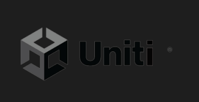

# Rtype Game Engine



The Rtype Game Engine is a C++ game engine inspired by Uniti, incorporating elements from its predecessor. It offers modularity through dynamic plugins, allowing for runtime configuration via JSON files.

## Getting Started

```cpp
int main() {
    try {
        Uniti::Core mainInstance(Uniti::Object::openJsonFile("./json/project.json"));
        mainInstance.start();
    } catch (std::exception &e) {
        std::cerr << e.what() << std::endl;
    }
}
```
## Example `project.json`

```cpp
{
    "plugins": [
        { "name": "plugin" },
        { "name": "RenderPlugin", "width": 600, "height": 600 },
        { "name": "NetworkPlugin" },
        { "name": "JSScriptPlugin", "path": "./javascript/index.js", "fps": 5 }
    ],
    "name": "name",
    "sceneFolder": "./json",
    "startScene": "startScene.json",
    "globalScene": "globalScene.json",
    "ObjectPlugins": "./ObjectPlugin",
    "CorePlugins": "./CorePlugin",
    "ScenePlugins": "./ScenePlugin"
}
```

## `project.json` Parameters

`name`: Project name.  
`sceneFolder`: Path to the folder containing all scenes (recursive).  
`startScene`: Name of the start scene (with .json extension).  
`globalScene`: Name of the global scene (with .json extension).  
`ObjectPlugins`: Path to the folder containing ObjectPlugins (non-recursive).  
`CorePlugins`: Path to the folder containing CorePlugins (non-recursive).  
`ScenePlugins`: Path to the folder containing ScenePlugins (non-recursive).  

## Scene Management
## Global Scene

The global scene persists throughout the engine's runtime. It is useful for storing game information like player lives or objects that handle user inputs based on their parameters.

## Start Scene

The start scene can be changed during the engine's cycle. It is useful for displaying the game map.

## Example Games

## Connect4

Connect4 Image

Connect4 Documentation

## Rtype

Rtype Image

Rtype Repository

## Reporting Issues

If you encounter any problems, please create an issue on GitHub.

## Contributors

Younes Bahri  
Vincent Balandi  
Abdelkader Mazouz  
Simon Vermeulen  
Swann Lagoute  

## Contacts

For inquiries, please contact:

younes1.bahri@epitech.eu  
swann.lagoute@epitech.eu  
abdelkader.mazouz@epitech.eu  
simon.vermeulen@epitech.eu  
vincent.balandi@epitech.eu  

## License

[MIT Licence](https://github.com/rtipe/Uniti/blob/19856c67d392aaea7be7fed8fd82cb25cbfe2874/LICENSE)
