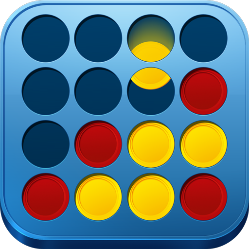

# Connect4



Connect4 is a multiplayer implementation of the classic game Connect Four, developed using our Uniti game engine, which is written in C++, and javascript node js for the script component. Connect4 allows you to play this iconic board game against friends or opponents online.

## How to Play

**Connect4** is a two-player game where the objective is to be the first to connect four of your colored discs in a row, vertically, horizontally, or diagonally.

- **Platform**: Play Connect4 on any device with a modern web browser.

## Technologies Used

- **Game Engine**: [Uniti](https://github.com/unitiengine/uniti)

- **Node JS**: [nodejs](https://nodejs.org/en/docs)


## License

This project is licensed under the MIT License. See the [LICENSE](LICENSE) file for details.

## Build and Installation

To run Connect4, follow these steps:

1. Clone the Connect4 repository from GitHub.

   ```bash
   git clone https://github.com/rtipe/Uniti
   
2. Create a build directory at the root.

    ```bash
    mkdir build
    cd build
    
3. Compile in the build directory.

    ```bash
    cmake ..
    cmake --build .
    
4. Run the binary in the bin directory.

    ```bash
    ./connect4

## Platforms

- Linux
- Windows
- MacOS
    
## Conclusion

Have fun playing Connect4! If you encounter any issues or have any questions, please refer to the Uniti game engine's documentation for further information.

## Contributors

. vincent.ballandi@epitech.eu
. simon.vermeulen@epitech.eu
. abdelkader.mazouz@epitech.eu
. younes.bahri@epitech.eu
